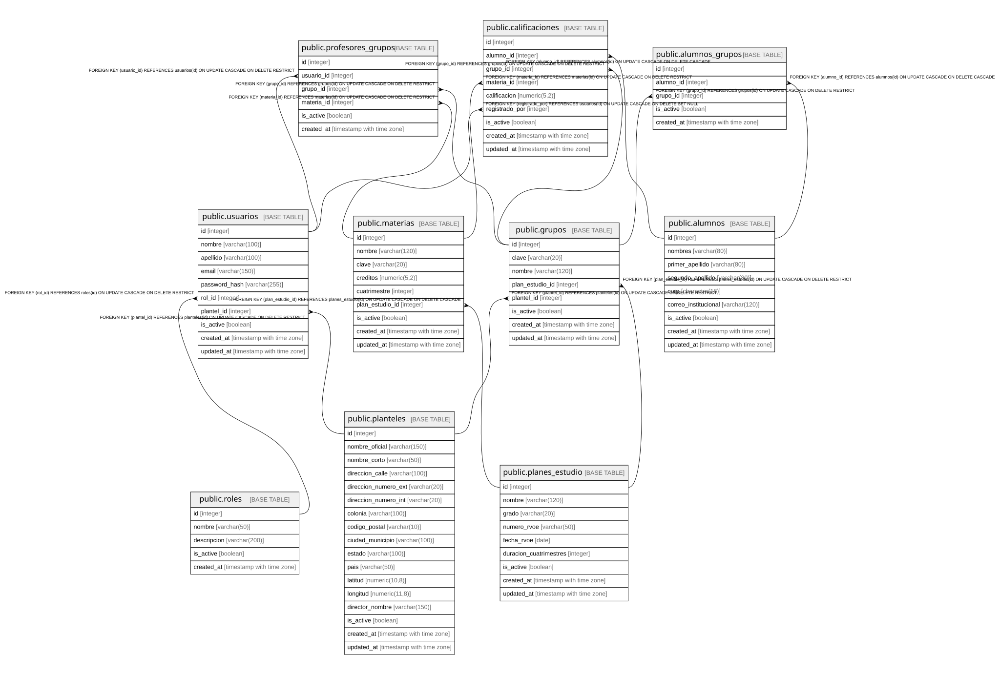

# ss-platform

## Tables

| Name | Columns | Comment | Type |
| ---- | ------- | ------- | ---- |
| [public.planteles](public.planteles.md) | 17 |  | BASE TABLE |
| [public.planes_estudio](public.planes_estudio.md) | 9 |  | BASE TABLE |
| [public.materias](public.materias.md) | 9 |  | BASE TABLE |
| [public.alumnos](public.alumnos.md) | 9 |  | BASE TABLE |
| [public.roles](public.roles.md) | 5 |  | BASE TABLE |
| [public.usuarios](public.usuarios.md) | 10 |  | BASE TABLE |
| [public.grupos](public.grupos.md) | 8 |  | BASE TABLE |
| [public.alumnos_grupos](public.alumnos_grupos.md) | 5 |  | BASE TABLE |
| [public.profesores_grupos](public.profesores_grupos.md) | 6 |  | BASE TABLE |
| [public.calificaciones](public.calificaciones.md) | 9 |  | BASE TABLE |

## Relations

---

> Generated by [tbls](https://github.com/k1LoW/tbls)
