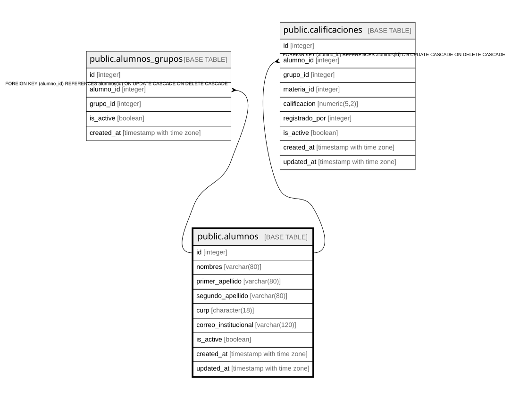

# public.alumnos

## Columns

| Name | Type | Default | Nullable | Children | Parents | Comment |
| ---- | ---- | ------- | -------- | -------- | ------- | ------- |
| id | integer |  | false | [public.alumnos_grupos](public.alumnos_grupos.md) |  |  |
| nombres | varchar(80) |  | false |  |  |  |
| primer_apellido | varchar(80) |  | false |  |  |  |
| segundo_apellido | varchar(80) |  | true |  |  |  |
| curp | character(18) |  | false |  |  |  |
| correo_institucional | varchar(120) |  | true |  |  |  |
| is_active | boolean | true | true |  |  |  |
| created_at | timestamp with time zone | CURRENT_TIMESTAMP | true |  |  |  |
| updated_at | timestamp with time zone | CURRENT_TIMESTAMP | true |  |  |  |

## Constraints

| Name | Type | Definition |
| ---- | ---- | ---------- |
| alumnos_curp_not_null | n | NOT NULL curp |
| alumnos_id_not_null | n | NOT NULL id |
| alumnos_nombres_not_null | n | NOT NULL nombres |
| alumnos_primer_apellido_not_null | n | NOT NULL primer_apellido |
| chk_curp_format | CHECK | CHECK ((curp ~ '^[A-Z][AEIOUX][A-Z]{2}[0-9]{2}(0[1-9]|1[0-2])(0[1-9]|1[0-9]|2[0-9]|3[0-1])[HMX][A-Z]{2}[B-DF-HJ-NP-TV-Z]{3}[0-9A-Z][0-9]$'::text)) |
| chk_curp_length | CHECK | CHECK ((char_length(curp) = 18)) |
| alumnos_pkey | PRIMARY KEY | PRIMARY KEY (id) |
| alumnos_curp_key | UNIQUE | UNIQUE (curp) |
| alumnos_correo_institucional_key | UNIQUE | UNIQUE (correo_institucional) |

## Indexes

| Name | Definition |
| ---- | ---------- |
| alumnos_pkey | CREATE UNIQUE INDEX alumnos_pkey ON public.alumnos USING btree (id) |
| alumnos_curp_key | CREATE UNIQUE INDEX alumnos_curp_key ON public.alumnos USING btree (curp) |
| alumnos_correo_institucional_key | CREATE UNIQUE INDEX alumnos_correo_institucional_key ON public.alumnos USING btree (correo_institucional) |
| idx_alumnos_correo | CREATE INDEX idx_alumnos_correo ON public.alumnos USING btree (correo_institucional) |

## Relations

---

> Generated by [tbls](https://github.com/k1LoW/tbls)
