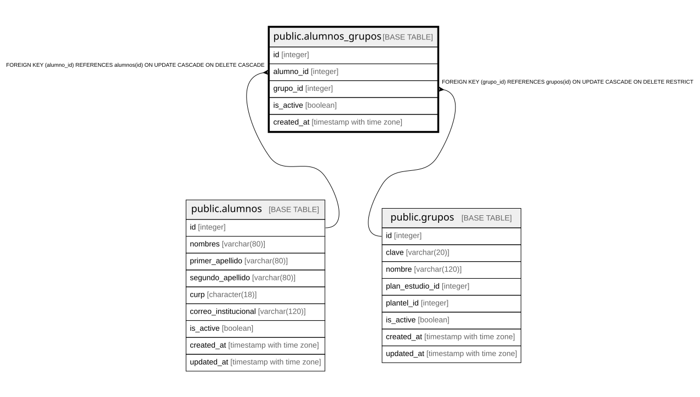

# public.alumnos_grupos

## Columns

| Name | Type | Default | Nullable | Children | Parents | Comment |
| ---- | ---- | ------- | -------- | -------- | ------- | ------- |
| id | integer |  | false |  |  |  |
| alumno_id | integer |  | false |  | [public.alumnos](public.alumnos.md) |  |
| grupo_id | integer |  | false |  | [public.grupos](public.grupos.md) |  |
| is_active | boolean | true | false |  |  |  |
| created_at | timestamp with time zone | CURRENT_TIMESTAMP | false |  |  |  |

## Constraints

| Name | Type | Definition |
| ---- | ---- | ---------- |
| alumnos_grupos_alumno_id_not_null | n | NOT NULL alumno_id |
| alumnos_grupos_created_at_not_null | n | NOT NULL created_at |
| alumnos_grupos_grupo_id_not_null | n | NOT NULL grupo_id |
| alumnos_grupos_id_not_null | n | NOT NULL id |
| alumnos_grupos_is_active_not_null | n | NOT NULL is_active |
| fk_alumnos_grupos_alumno | FOREIGN KEY | FOREIGN KEY (alumno_id) REFERENCES alumnos(id) ON UPDATE CASCADE ON DELETE CASCADE |
| fk_alumnos_grupos_grupo | FOREIGN KEY | FOREIGN KEY (grupo_id) REFERENCES grupos(id) ON UPDATE CASCADE ON DELETE RESTRICT |
| alumnos_grupos_pkey | PRIMARY KEY | PRIMARY KEY (id) |
| uq_alumno_grupo | UNIQUE | UNIQUE (alumno_id, grupo_id) |

## Indexes

| Name | Definition |
| ---- | ---------- |
| alumnos_grupos_pkey | CREATE UNIQUE INDEX alumnos_grupos_pkey ON public.alumnos_grupos USING btree (id) |
| uq_alumno_grupo | CREATE UNIQUE INDEX uq_alumno_grupo ON public.alumnos_grupos USING btree (alumno_id, grupo_id) |
| idx_alumnos_grupos_alumno | CREATE INDEX idx_alumnos_grupos_alumno ON public.alumnos_grupos USING btree (alumno_id) |
| idx_alumnos_grupos_grupo | CREATE INDEX idx_alumnos_grupos_grupo ON public.alumnos_grupos USING btree (grupo_id) |

## Relations

---

> Generated by [tbls](https://github.com/k1LoW/tbls)
