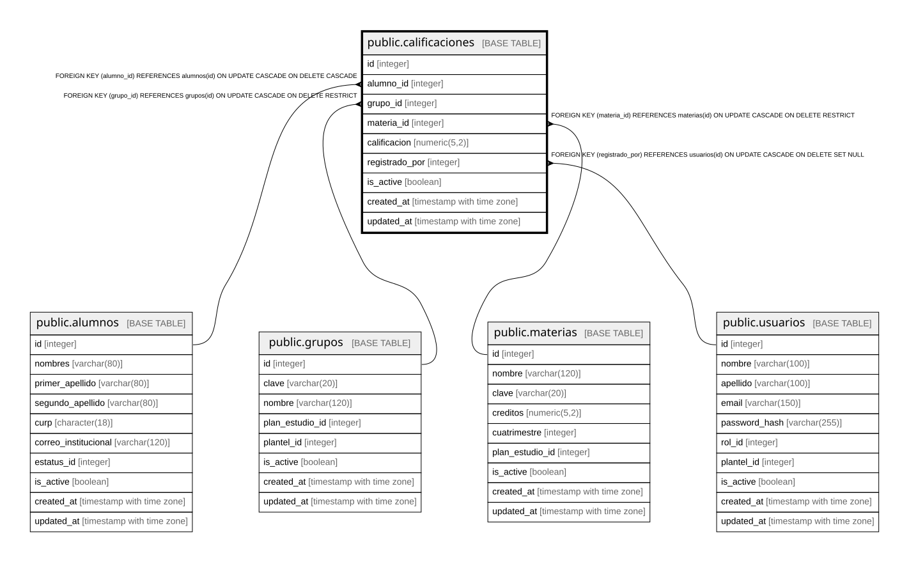

# public.calificaciones

## Columns

| Name | Type | Default | Nullable | Children | Parents | Comment |
| ---- | ---- | ------- | -------- | -------- | ------- | ------- |
| id | integer |  | false |  |  |  |
| alumno_id | integer |  | false |  | [public.alumnos](public.alumnos.md) |  |
| grupo_id | integer |  | false |  | [public.grupos](public.grupos.md) |  |
| materia_id | integer |  | false |  | [public.materias](public.materias.md) |  |
| calificacion | numeric(5,2) |  | false |  |  |  |
| registrado_por | integer |  | true |  | [public.usuarios](public.usuarios.md) |  |
| is_active | boolean | true | true |  |  |  |
| created_at | timestamp with time zone | CURRENT_TIMESTAMP | true |  |  |  |
| updated_at | timestamp with time zone | CURRENT_TIMESTAMP | true |  |  |  |

## Constraints

| Name | Type | Definition |
| ---- | ---- | ---------- |
| calificaciones_alumno_id_not_null | n | NOT NULL alumno_id |
| calificaciones_calificacion_not_null | n | NOT NULL calificacion |
| calificaciones_grupo_id_not_null | n | NOT NULL grupo_id |
| calificaciones_id_not_null | n | NOT NULL id |
| calificaciones_materia_id_not_null | n | NOT NULL materia_id |
| chk_calificacion | CHECK | CHECK (((calificacion >= (0)::numeric) AND (calificacion <= (100)::numeric))) |
| fk_calificaciones_materia | FOREIGN KEY | FOREIGN KEY (materia_id) REFERENCES materias(id) ON UPDATE CASCADE ON DELETE RESTRICT |
| fk_calificaciones_alumno | FOREIGN KEY | FOREIGN KEY (alumno_id) REFERENCES alumnos(id) ON UPDATE CASCADE ON DELETE CASCADE |
| fk_calificaciones_registrado_por | FOREIGN KEY | FOREIGN KEY (registrado_por) REFERENCES usuarios(id) ON UPDATE CASCADE ON DELETE SET NULL |
| fk_calificaciones_grupo | FOREIGN KEY | FOREIGN KEY (grupo_id) REFERENCES grupos(id) ON UPDATE CASCADE ON DELETE RESTRICT |
| calificaciones_pkey | PRIMARY KEY | PRIMARY KEY (id) |
| uq_alumno_materia_grupo | UNIQUE | UNIQUE (alumno_id, materia_id, grupo_id) |

## Indexes

| Name | Definition |
| ---- | ---------- |
| calificaciones_pkey | CREATE UNIQUE INDEX calificaciones_pkey ON public.calificaciones USING btree (id) |
| uq_alumno_materia_grupo | CREATE UNIQUE INDEX uq_alumno_materia_grupo ON public.calificaciones USING btree (alumno_id, materia_id, grupo_id) |
| idx_calificaciones_alumno | CREATE INDEX idx_calificaciones_alumno ON public.calificaciones USING btree (alumno_id) |
| idx_calificaciones_grupo | CREATE INDEX idx_calificaciones_grupo ON public.calificaciones USING btree (grupo_id) |
| idx_calificaciones_materia | CREATE INDEX idx_calificaciones_materia ON public.calificaciones USING btree (materia_id) |

## Relations

---

> Generated by [tbls](https://github.com/k1LoW/tbls)
