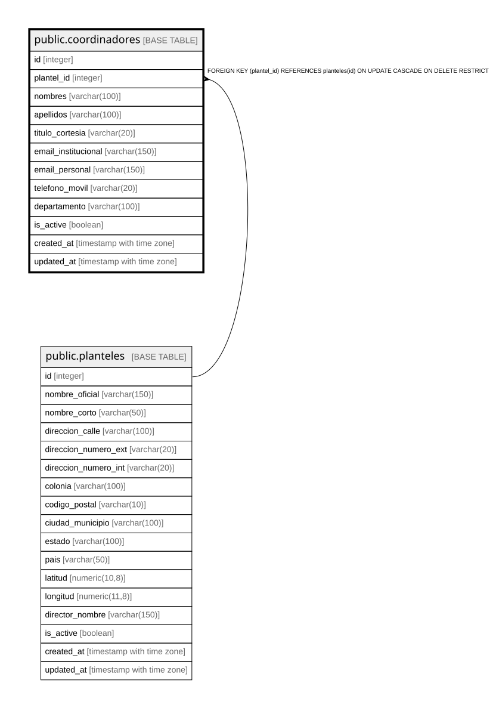

# public.coordinadores

## Columns

| Name | Type | Default | Nullable | Children | Parents | Comment |
| ---- | ---- | ------- | -------- | -------- | ------- | ------- |
| id | integer |  | false |  |  |  |
| plantel_id | integer |  | false |  | [public.planteles](public.planteles.md) |  |
| nombres | varchar(100) |  | false |  |  |  |
| apellidos | varchar(100) |  | false |  |  |  |
| titulo_cortesia | varchar(20) |  | true |  |  |  |
| email_institucional | varchar(150) |  | false |  |  |  |
| email_personal | varchar(150) |  | true |  |  |  |
| telefono_movil | varchar(20) |  | true |  |  |  |
| departamento | varchar(100) |  | true |  |  |  |
| is_active | boolean | true | true |  |  |  |
| created_at | timestamp with time zone | CURRENT_TIMESTAMP | true |  |  |  |
| updated_at | timestamp with time zone | CURRENT_TIMESTAMP | true |  |  |  |

## Constraints

| Name | Type | Definition |
| ---- | ---- | ---------- |
| coordinadores_apellidos_not_null | n | NOT NULL apellidos |
| coordinadores_email_institucional_not_null | n | NOT NULL email_institucional |
| coordinadores_id_not_null | n | NOT NULL id |
| coordinadores_nombres_not_null | n | NOT NULL nombres |
| coordinadores_plantel_id_not_null | n | NOT NULL plantel_id |
| fk_coordinador_plantel | FOREIGN KEY | FOREIGN KEY (plantel_id) REFERENCES planteles(id) ON UPDATE CASCADE ON DELETE RESTRICT |
| coordinadores_pkey | PRIMARY KEY | PRIMARY KEY (id) |
| coordinadores_email_institucional_key | UNIQUE | UNIQUE (email_institucional) |

## Indexes

| Name | Definition |
| ---- | ---------- |
| coordinadores_pkey | CREATE UNIQUE INDEX coordinadores_pkey ON public.coordinadores USING btree (id) |
| coordinadores_email_institucional_key | CREATE UNIQUE INDEX coordinadores_email_institucional_key ON public.coordinadores USING btree (email_institucional) |
| idx_coordinadores_plantel | CREATE INDEX idx_coordinadores_plantel ON public.coordinadores USING btree (plantel_id) |
| idx_coordinadores_email | CREATE INDEX idx_coordinadores_email ON public.coordinadores USING btree (email_institucional) |

## Relations

---

> Generated by [tbls](https://github.com/k1LoW/tbls)
