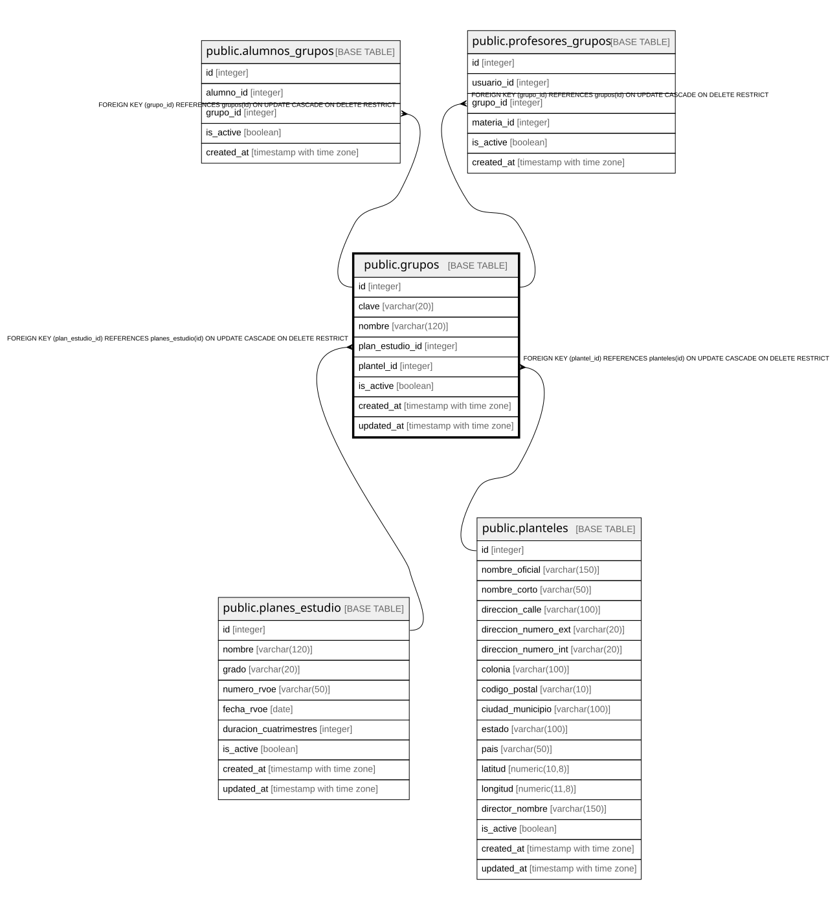

# public.grupos

## Columns

| Name | Type | Default | Nullable | Children | Parents | Comment |
| ---- | ---- | ------- | -------- | -------- | ------- | ------- |
| id | integer |  | false | [public.alumnos_grupos](public.alumnos_grupos.md) [public.profesores_grupos](public.profesores_grupos.md) [public.calificaciones](public.calificaciones.md) |  |  |
| clave | varchar(20) | ('CG-'::text || (nextval('grupos_numero_seq'::regclass))::text) | false |  |  |  |
| nombre | varchar(120) |  | false |  |  |  |
| plan_estudio_id | integer |  | false |  | [public.planes_estudio](public.planes_estudio.md) |  |
| plantel_id | integer |  | false |  | [public.planteles](public.planteles.md) |  |
| is_active | boolean | true | true |  |  |  |
| created_at | timestamp with time zone | CURRENT_TIMESTAMP | true |  |  |  |
| updated_at | timestamp with time zone | CURRENT_TIMESTAMP | true |  |  |  |

## Constraints

| Name | Type | Definition |
| ---- | ---- | ---------- |
| grupos_clave_not_null | n | NOT NULL clave |
| grupos_id_not_null | n | NOT NULL id |
| grupos_nombre_not_null | n | NOT NULL nombre |
| grupos_plan_estudio_id_not_null | n | NOT NULL plan_estudio_id |
| grupos_plantel_id_not_null | n | NOT NULL plantel_id |
| fk_grupos_plantel | FOREIGN KEY | FOREIGN KEY (plantel_id) REFERENCES planteles(id) ON UPDATE CASCADE ON DELETE RESTRICT |
| fk_grupos_plan_estudio | FOREIGN KEY | FOREIGN KEY (plan_estudio_id) REFERENCES planes_estudio(id) ON UPDATE CASCADE ON DELETE RESTRICT |
| grupos_pkey | PRIMARY KEY | PRIMARY KEY (id) |
| grupos_clave_key | UNIQUE | UNIQUE (clave) |

## Indexes

| Name | Definition |
| ---- | ---------- |
| grupos_pkey | CREATE UNIQUE INDEX grupos_pkey ON public.grupos USING btree (id) |
| grupos_clave_key | CREATE UNIQUE INDEX grupos_clave_key ON public.grupos USING btree (clave) |
| idx_grupos_plan_estudio | CREATE INDEX idx_grupos_plan_estudio ON public.grupos USING btree (plan_estudio_id) |
| idx_grupos_plantel | CREATE INDEX idx_grupos_plantel ON public.grupos USING btree (plantel_id) |

## Relations

---

> Generated by [tbls](https://github.com/k1LoW/tbls)
