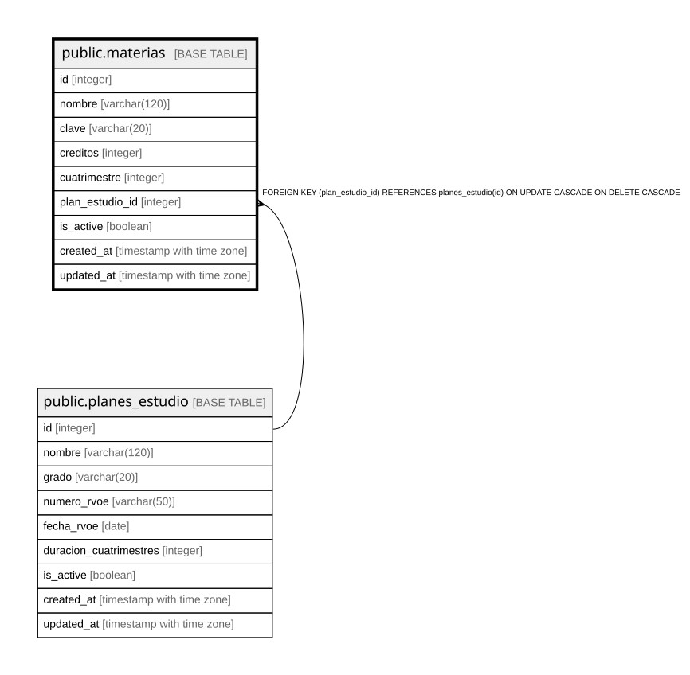

# public.materias

## Columns

| Name | Type | Default | Nullable | Children | Parents | Comment |
| ---- | ---- | ------- | -------- | -------- | ------- | ------- |
| id | integer |  | false |  |  |  |
| nombre | varchar(120) |  | false |  |  |  |
| clave | varchar(20) |  | true |  |  |  |
| creditos | integer |  | true |  |  |  |
| cuatrimestre | integer |  | true |  |  |  |
| plan_estudio_id | integer |  | false |  | [public.planes_estudio](public.planes_estudio.md) |  |
| is_active | boolean | true | true |  |  |  |
| created_at | timestamp with time zone | CURRENT_TIMESTAMP | true |  |  |  |
| updated_at | timestamp with time zone | CURRENT_TIMESTAMP | true |  |  |  |

## Constraints

| Name | Type | Definition |
| ---- | ---- | ---------- |
| materias_id_not_null | n | NOT NULL id |
| materias_nombre_not_null | n | NOT NULL nombre |
| materias_plan_estudio_id_not_null | n | NOT NULL plan_estudio_id |
| fk_materias_plan_estudio | FOREIGN KEY | FOREIGN KEY (plan_estudio_id) REFERENCES planes_estudio(id) ON UPDATE CASCADE ON DELETE CASCADE |
| materias_pkey | PRIMARY KEY | PRIMARY KEY (id) |

## Indexes

| Name | Definition |
| ---- | ---------- |
| materias_pkey | CREATE UNIQUE INDEX materias_pkey ON public.materias USING btree (id) |
| idx_materias_plan_estudio | CREATE INDEX idx_materias_plan_estudio ON public.materias USING btree (plan_estudio_id) |

## Relations

---

> Generated by [tbls](https://github.com/k1LoW/tbls)
