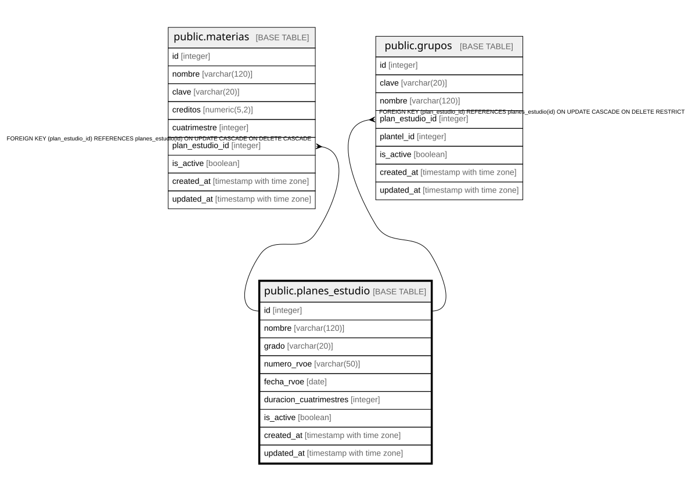

# public.planes_estudio

## Columns

| Name | Type | Default | Nullable | Children | Parents | Comment |
| ---- | ---- | ------- | -------- | -------- | ------- | ------- |
| id | integer |  | false | [public.materias](public.materias.md) [public.grupos](public.grupos.md) |  |  |
| nombre | varchar(120) |  | false |  |  |  |
| grado | varchar(20) |  | false |  |  |  |
| numero_rvoe | varchar(50) |  | false |  |  |  |
| fecha_rvoe | date |  | false |  |  |  |
| duracion_cuatrimestres | integer |  | false |  |  |  |
| is_active | boolean | true | true |  |  |  |
| created_at | timestamp with time zone | CURRENT_TIMESTAMP | true |  |  |  |
| updated_at | timestamp with time zone | CURRENT_TIMESTAMP | true |  |  |  |

## Constraints

| Name | Type | Definition |
| ---- | ---- | ---------- |
| chk_grado | CHECK | CHECK (((grado)::text = ANY ((ARRAY['Licenciatura'::character varying, 'Maestría'::character varying, 'Doctorado'::character varying])::text[]))) |
| planes_estudio_duracion_cuatrimestres_not_null | n | NOT NULL duracion_cuatrimestres |
| planes_estudio_fecha_rvoe_not_null | n | NOT NULL fecha_rvoe |
| planes_estudio_grado_not_null | n | NOT NULL grado |
| planes_estudio_id_not_null | n | NOT NULL id |
| planes_estudio_nombre_not_null | n | NOT NULL nombre |
| planes_estudio_numero_rvoe_not_null | n | NOT NULL numero_rvoe |
| planes_estudio_pkey | PRIMARY KEY | PRIMARY KEY (id) |
| planes_estudio_numero_rvoe_key | UNIQUE | UNIQUE (numero_rvoe) |

## Indexes

| Name | Definition |
| ---- | ---------- |
| planes_estudio_pkey | CREATE UNIQUE INDEX planes_estudio_pkey ON public.planes_estudio USING btree (id) |
| planes_estudio_numero_rvoe_key | CREATE UNIQUE INDEX planes_estudio_numero_rvoe_key ON public.planes_estudio USING btree (numero_rvoe) |

## Relations

---

> Generated by [tbls](https://github.com/k1LoW/tbls)
