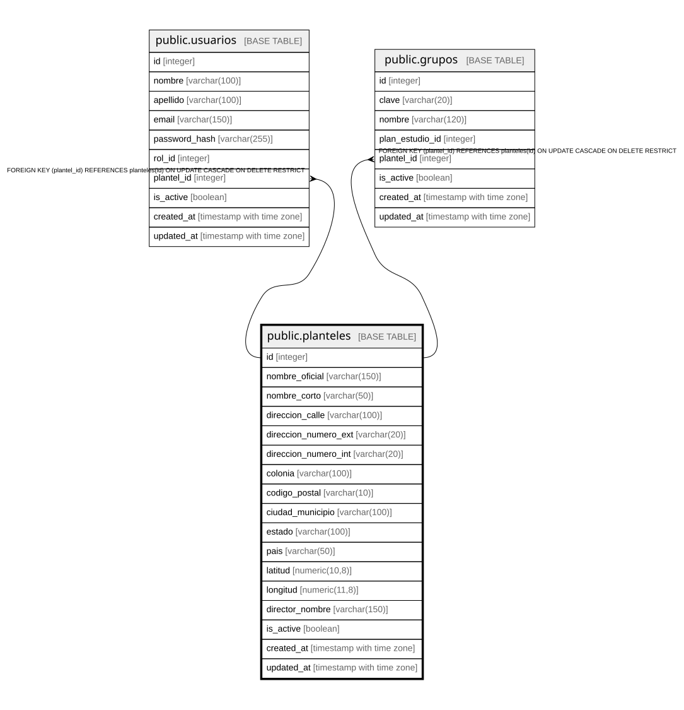

# public.planteles

## Columns

| Name | Type | Default | Nullable | Children | Parents | Comment |
| ---- | ---- | ------- | -------- | -------- | ------- | ------- |
| id | integer |  | false | [public.usuarios](public.usuarios.md) [public.grupos](public.grupos.md) |  |  |
| nombre_oficial | varchar(150) |  | false |  |  |  |
| nombre_corto | varchar(50) |  | true |  |  |  |
| direccion_calle | varchar(100) |  | true |  |  |  |
| direccion_numero_ext | varchar(20) |  | true |  |  |  |
| direccion_numero_int | varchar(20) |  | true |  |  |  |
| colonia | varchar(100) |  | true |  |  |  |
| codigo_postal | varchar(10) |  | true |  |  |  |
| ciudad_municipio | varchar(100) |  | false |  |  |  |
| estado | varchar(100) |  | false |  |  |  |
| pais | varchar(50) | 'México'::character varying | true |  |  |  |
| latitud | numeric(10,8) |  | true |  |  |  |
| longitud | numeric(11,8) |  | true |  |  |  |
| director_nombre | varchar(150) |  | true |  |  |  |
| is_active | boolean | true | true |  |  |  |
| created_at | timestamp with time zone | CURRENT_TIMESTAMP | true |  |  |  |
| updated_at | timestamp with time zone | CURRENT_TIMESTAMP | true |  |  |  |

## Constraints

| Name | Type | Definition |
| ---- | ---- | ---------- |
| planteles_ciudad_municipio_not_null | n | NOT NULL ciudad_municipio |
| planteles_estado_not_null | n | NOT NULL estado |
| planteles_id_not_null | n | NOT NULL id |
| planteles_nombre_oficial_not_null | n | NOT NULL nombre_oficial |
| planteles_pkey | PRIMARY KEY | PRIMARY KEY (id) |

## Indexes

| Name | Definition |
| ---- | ---------- |
| planteles_pkey | CREATE UNIQUE INDEX planteles_pkey ON public.planteles USING btree (id) |
| idx_planteles_ciudad | CREATE INDEX idx_planteles_ciudad ON public.planteles USING btree (ciudad_municipio) |
| idx_planteles_estado | CREATE INDEX idx_planteles_estado ON public.planteles USING btree (estado) |

## Relations

---

> Generated by [tbls](https://github.com/k1LoW/tbls)
