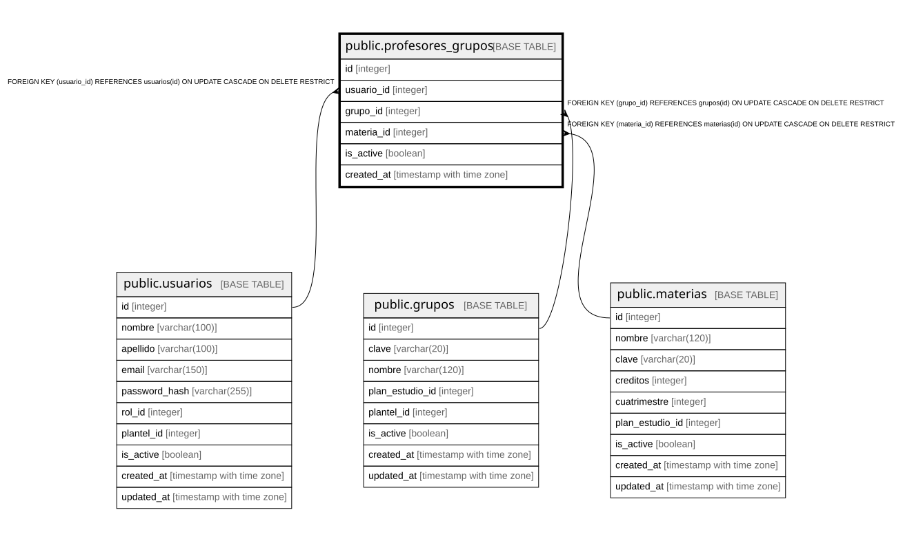

# public.profesores_grupos

## Columns

| Name | Type | Default | Nullable | Children | Parents | Comment |
| ---- | ---- | ------- | -------- | -------- | ------- | ------- |
| id | integer |  | false |  |  |  |
| usuario_id | integer |  | false |  | [public.usuarios](public.usuarios.md) |  |
| grupo_id | integer |  | false |  | [public.grupos](public.grupos.md) |  |
| is_active | boolean | true | true |  |  |  |
| created_at | timestamp with time zone | CURRENT_TIMESTAMP | true |  |  |  |

## Constraints

| Name | Type | Definition |
| ---- | ---- | ---------- |
| profesores_grupos_grupo_id_not_null | n | NOT NULL grupo_id |
| profesores_grupos_id_not_null | n | NOT NULL id |
| profesores_grupos_usuario_id_not_null | n | NOT NULL usuario_id |
| fk_profesores_grupos_usuario | FOREIGN KEY | FOREIGN KEY (usuario_id) REFERENCES usuarios(id) ON UPDATE CASCADE ON DELETE RESTRICT |
| fk_profesores_grupos_grupo | FOREIGN KEY | FOREIGN KEY (grupo_id) REFERENCES grupos(id) ON UPDATE CASCADE ON DELETE RESTRICT |
| profesores_grupos_pkey | PRIMARY KEY | PRIMARY KEY (id) |
| uq_profesor_grupo | UNIQUE | UNIQUE (usuario_id, grupo_id) |

## Indexes

| Name | Definition |
| ---- | ---------- |
| profesores_grupos_pkey | CREATE UNIQUE INDEX profesores_grupos_pkey ON public.profesores_grupos USING btree (id) |
| uq_profesor_grupo | CREATE UNIQUE INDEX uq_profesor_grupo ON public.profesores_grupos USING btree (usuario_id, grupo_id) |
| idx_profesores_grupos_usuario | CREATE INDEX idx_profesores_grupos_usuario ON public.profesores_grupos USING btree (usuario_id) |
| idx_profesores_grupos_grupo | CREATE INDEX idx_profesores_grupos_grupo ON public.profesores_grupos USING btree (grupo_id) |

## Relations

---

> Generated by [tbls](https://github.com/k1LoW/tbls)
