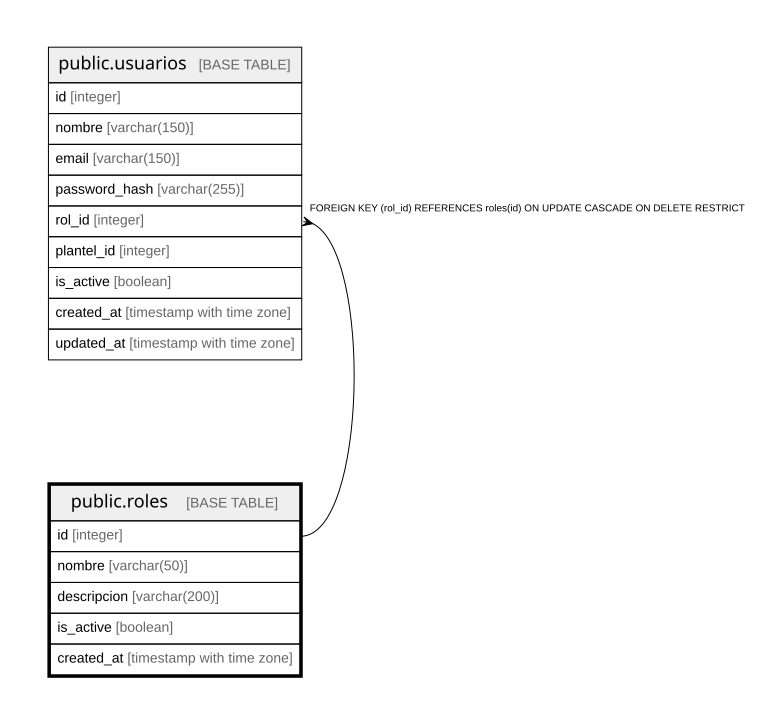

# public.roles

## Columns

| Name | Type | Default | Nullable | Children | Parents | Comment |
| ---- | ---- | ------- | -------- | -------- | ------- | ------- |
| id | integer |  | false | [public.usuarios](public.usuarios.md) |  |  |
| nombre | varchar(50) |  | false |  |  |  |
| descripcion | varchar(200) |  | false |  |  |  |
| is_active | boolean | true | false |  |  |  |
| created_at | timestamp with time zone | CURRENT_TIMESTAMP | false |  |  |  |

## Constraints

| Name | Type | Definition |
| ---- | ---- | ---------- |
| roles_created_at_not_null | n | NOT NULL created_at |
| roles_descripcion_not_null | n | NOT NULL descripcion |
| roles_id_not_null | n | NOT NULL id |
| roles_is_active_not_null | n | NOT NULL is_active |
| roles_nombre_not_null | n | NOT NULL nombre |
| roles_pkey | PRIMARY KEY | PRIMARY KEY (id) |
| roles_nombre_key | UNIQUE | UNIQUE (nombre) |

## Indexes

| Name | Definition |
| ---- | ---------- |
| roles_pkey | CREATE UNIQUE INDEX roles_pkey ON public.roles USING btree (id) |
| roles_nombre_key | CREATE UNIQUE INDEX roles_nombre_key ON public.roles USING btree (nombre) |

## Relations

---

> Generated by [tbls](https://github.com/k1LoW/tbls)
