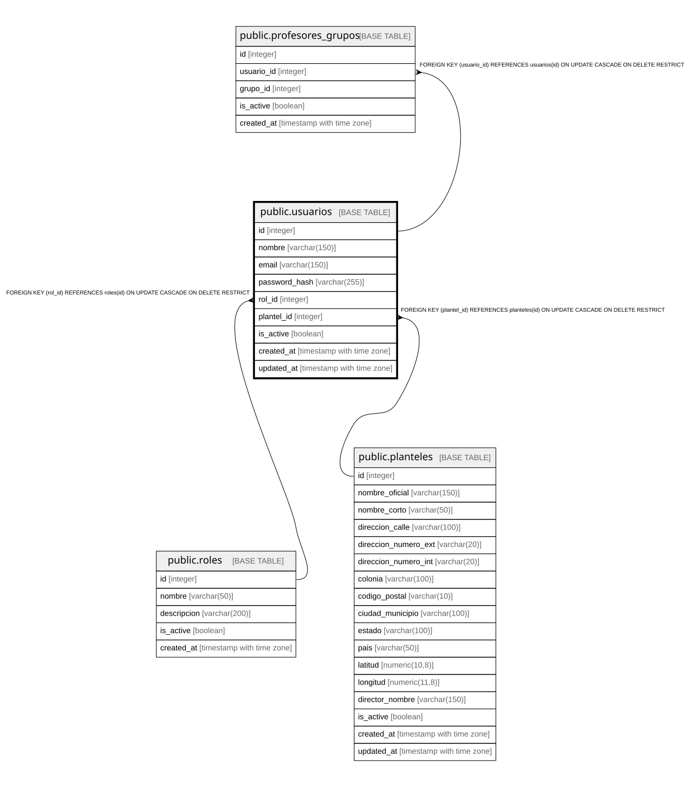

# public.usuarios

## Columns

| Name | Type | Default | Nullable | Children | Parents | Comment |
| ---- | ---- | ------- | -------- | -------- | ------- | ------- |
| id | integer |  | false | [public.profesores_grupos](public.profesores_grupos.md) [public.calificaciones](public.calificaciones.md) |  |  |
| nombre | varchar(100) |  | false |  |  |  |
| apellido | varchar(100) |  | false |  |  |  |
| email | varchar(150) |  | false |  |  |  |
| password_hash | varchar(255) |  | false |  |  |  |
| rol_id | integer |  | false |  | [public.roles](public.roles.md) |  |
| plantel_id | integer |  | false |  | [public.planteles](public.planteles.md) |  |
| is_active | boolean | true | false |  |  |  |
| created_at | timestamp with time zone | CURRENT_TIMESTAMP | false |  |  |  |
| updated_at | timestamp with time zone | CURRENT_TIMESTAMP | false |  |  |  |

## Constraints

| Name | Type | Definition |
| ---- | ---- | ---------- |
| usuarios_apellido_not_null | n | NOT NULL apellido |
| usuarios_created_at_not_null | n | NOT NULL created_at |
| usuarios_email_not_null | n | NOT NULL email |
| usuarios_id_not_null | n | NOT NULL id |
| usuarios_is_active_not_null | n | NOT NULL is_active |
| usuarios_nombre_not_null | n | NOT NULL nombre |
| usuarios_password_hash_not_null | n | NOT NULL password_hash |
| usuarios_plantel_id_not_null | n | NOT NULL plantel_id |
| usuarios_rol_id_not_null | n | NOT NULL rol_id |
| usuarios_updated_at_not_null | n | NOT NULL updated_at |
| fk_usuarios_plantel | FOREIGN KEY | FOREIGN KEY (plantel_id) REFERENCES planteles(id) ON UPDATE CASCADE ON DELETE RESTRICT |
| fk_usuarios_rol | FOREIGN KEY | FOREIGN KEY (rol_id) REFERENCES roles(id) ON UPDATE CASCADE ON DELETE RESTRICT |
| usuarios_pkey | PRIMARY KEY | PRIMARY KEY (id) |
| usuarios_email_key | UNIQUE | UNIQUE (email) |

## Indexes

| Name | Definition |
| ---- | ---------- |
| usuarios_pkey | CREATE UNIQUE INDEX usuarios_pkey ON public.usuarios USING btree (id) |
| usuarios_email_key | CREATE UNIQUE INDEX usuarios_email_key ON public.usuarios USING btree (email) |
| idx_usuarios_email | CREATE INDEX idx_usuarios_email ON public.usuarios USING btree (email) |
| idx_usuarios_rol | CREATE INDEX idx_usuarios_rol ON public.usuarios USING btree (rol_id) |
| idx_usuarios_plantel | CREATE INDEX idx_usuarios_plantel ON public.usuarios USING btree (plantel_id) |

## Relations

---

> Generated by [tbls](https://github.com/k1LoW/tbls)
